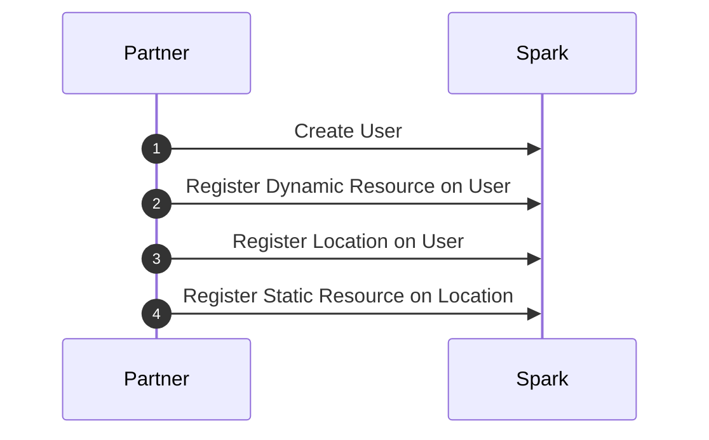
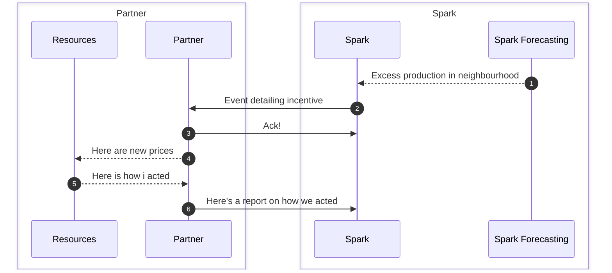

```mermaid
sequenceDiagram
	autonumber
    participant P as Partner
    participant S as Spark
    
	P->>S: Create User
	P->>S: Register Dynamic Resource on User
    P->>S: Register Location on User
	P->>S: Register Static Resource on Location
```

```mermaid
sequenceDiagram
	autonumber
	
	box Partner
	participant R as Resources
    participant P as Partner
    end

	box Spark
    participant S as Spark
    participant F as Spark Forecasting
    end
    
	F-->>S: Excess production in neighbourhood
    S->>P: Event detailing incentive
	P->>S: Ack!

	P-->>R: Here are new prices
	R-->>P: Here is how i acted

	P->>S: Here's a report on how we acted
```
