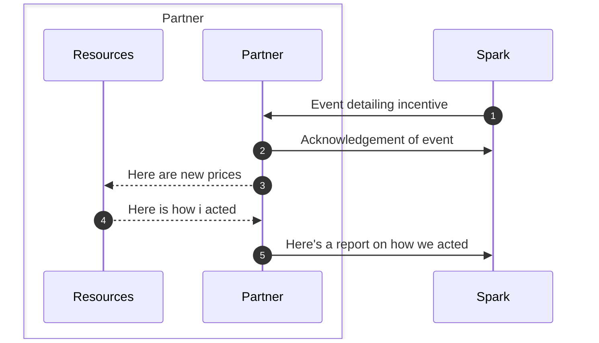

# Introduction

Welcome to the Energy Coordination API! The API which aims to guide energy resources to win the game of efficient energy use! It's not about controlling the resources, but rather giving them the right incentives to play their best game.

Essentially, our API is about smart collaboration between various energy resources at the neighbourhood level. It encourages devices, like electric vehicles or solar panels, to adjust their energy use and production in response to the state of the electricity grid. For example, if there's an abundance of solar power, the API might encourage charging electric vehicles. The magic here is that it's all done through incentives, and as our partner, you have the choice on how to respond.

## How to get started

-   Become a partner by signing up to receive credentials on [Spark Studio](https://voluespark.com/)
-   Test the credentials by [authenticating](/getting-started/Authentication) with the API
-   The base URL for the API is `https://api.sandbox.voluespark.com/energy-coordination/v1`
-   Enroll your resources into our API
-   Set up a webhook to receive events

## How it works

Our service keeps track of the state of the electric grid and sends out events when we detect it would be beneficial for a neighbourhood to consume more or less energy. You, as our partner, decide how you want to act when we send you an event, all we ask in return is that you send us a report telling us what you did.

In order for us to know which resources are available for energy coordination, we need to know about the state of your energy resources. This is done through "reports" which you send to us. The reports contain information about the state of your energy resources and how they have been affected by the events. We use the reports to monitor where we have capacity to influence the grid and to verify that you are acting on the events.

Our events are based on neighbourhoods and what would benefit those locally. When you send us information about your resources we use their location to craft targeted events for those resources.

## Basic endpoint flows

The API is built around the concept of resources, events and reports. This diagram shows the basic idea behind the API.

### Registering a resource

To begin with, you need to register your resource with the API. This is done by sending a `POST` request to the `/resources` endpoint. The request should contain information about your resource, such as its type and its capabilities. The API accepts resource id set by you, which you will use to identify your resource in future requests.

### Reporting the state of a resource

Once you have registered your resource, you can start sending reports to the API. The reports should contain information about the state of your resource, such as its current energy usage and its current energy production. The API will use the reports to monitor the state of your resource and to verify that you are acting on the events.

### Fetching events

You fetch events from the API at any time. The events contain information about the state of the electricity grid and suggestions on how to act on the events. The API will send you events that are relevant to your resource. The API can also send you events when it thinks it's beneficial for you to act on them (see next section for more information).
